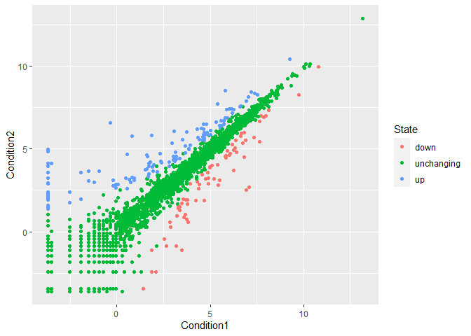

# Class 5: Data Visualization with ggplot
Heidi Nam
2023-04-19

## Base R Plotting

We are going to start by generating the plot of class 04. This code is
plotting the **cars** `dataset`.

``` r
plot(cars)
```


Q1: For which phases is data visualization important in our scientific
workflows?  
A: All of the above - Communication of results, Exploratory Data
Analysis (EDA), Detection of Outliers

Q2: True or False? The ggplot2 package comes already installed with R?  
A: False.

Q: Which plot types are typically NOT used to compare distributions of
numeric variables?  
A: Network graphs

Q: Which statement about data visualization with ggplot2 is incorrect?  
A: ggplot2 is the only way to create plots in R.

## Ggplot2

First we need to install the package. We do this by using the
`install.packages` command.

``` r
# install.packages('ggplot2')
```

After that, we need to load the package.

``` r
library(ggplot2)
```

We are going to build the plot of the cars `dataframe` by using ggplot2.

``` r
ggplot(data = cars)
```


``` r
ggplot(data = cars) + 
  aes(x=speed,y=dist) 
```


``` r
ggplot(data = cars) + 
  aes(x=speed,y=dist) + 
  geom_point()
```


``` r
ggplot(data = cars) + 
  aes(x=speed,y=dist) + 
  geom_point() +
  geom_smooth(method=lm,se=FALSE) +
  labs(x="speed (MPH)", 
       y="Stopping distance (ft)", 
       title = "Speed and stopping Distances of Cars", 
       caption="Dataset: 'cars'") +
  theme_bw()
```

    `geom_smooth()` using formula = 'y ~ x'


Q: Which geometric layer should be used to create scatter plots in
ggplot2?  
A: `geom_point()`

## Plotting gene expression data

Loading the data from the URL

``` r
url <- "https://bioboot.github.io/bimm143_S20/class-material/up_down_expression.txt"
genes <- read.delim(url)
head(genes)
```

            Gene Condition1 Condition2      State
    1      A4GNT -3.6808610 -3.4401355 unchanging
    2       AAAS  4.5479580  4.3864126 unchanging
    3      AASDH  3.7190695  3.4787276 unchanging
    4       AATF  5.0784720  5.0151916 unchanging
    5       AATK  0.4711421  0.5598642 unchanging
    6 AB015752.4 -3.6808610 -3.5921390 unchanging

Q. Use the `nrow()` function to find out how man genes are in this
dataset.

``` r
nrow(genes)
```

    [1] 5196

Q: Use the `colnames()` function and the `ncol()` function on the
`genes` data frame to find out what the column names are (we will need
these later) and how many columns there are. How many columns did you
find?

``` r
ncol(genes)
```

    [1] 4

``` r
colnames(genes)
```

    [1] "Gene"       "Condition1" "Condition2" "State"     

Q: Use the `table()` function on the `State` column of this data.frame
to find out how many ‘up’ regulated genes there are. What is your
answer?

``` r
table(genes[,"State"])
```


          down unchanging         up 
            72       4997        127 

Q: Using your values above and 2 significant figures. What fraction of
total genes is up-regulated in this dataset?

``` r
(table(genes[,"State"]) / nrow(genes)) * 100
```


          down unchanging         up 
      1.385681  96.170131   2.444188 

A: 2.44%

Initial ggplot

``` r
ggplot(data = genes) +
  aes(x=Condition1,y=Condition2) + 
  geom_point() 
```


Adding color to the plot and storing it

``` r
p1 <- ggplot(data = genes) + 
  aes(x=Condition1,y=Condition2,col=State) + 
  geom_point()
p1
```



Let’s change the color scheme.

``` r
p2 <- p1 + scale_colour_manual(values=c("blue","gray","red"))
p2
```


Let’s add some labels.

``` r
p2 + labs(x="Control (no drug)", 
          y="Drug Treatment",
          title="Gene Expression Changes Upon Drug Treatment", 
          caption= "BIMM143 - Class 05")
```


