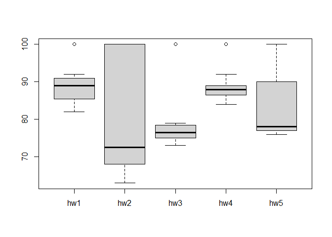

# Class 6: R functions
Heidi Nam

In this class we will develop our own R function to calculate average
grades in a fictional class.

We will start with a simplified version of the problem, just calculating
the average grade of one student.

## Simplified version

``` r
# example input vectors to start with
student1<-c(100,100,100,100,100,100,100,90) 
student2<-c(100,NA,90,90,90,90,97,80) 
student3<-c(90,NA,NA,NA,NA,NA,NA,NA)
```

We are going to start by calculating the average score of the homeworks.

``` r
mean(student1)
```

    [1] 98.75

To get the minimum score we can use `which.min`.

``` r
which.min(student1)
```

    [1] 8

I can do the average of the first 7 homework scores.

``` r
mean(student1[1:7])
```

    [1] 100

Another way to select the first 7 homework scores:

``` r
student1[1:7]
```

    [1] 100 100 100 100 100 100 100

``` r
student1[-8]
```

    [1] 100 100 100 100 100 100 100

Another way to drop the lowest score:

``` r
student1_drop_lowest <- student1[-which.min(student1)]
student1_drop_lowest
```

    [1] 100 100 100 100 100 100 100

I can get the mean of the homework sores after dropping the lowest score
by doing:

``` r
mean(student1_drop_lowest)
```

    [1] 100

We have our first working snippet of code!

Let’s try to generalize it to student 2.

``` r
student2_drop_lowest <- student2[-which.min(student2)]
student2_drop_lowest
```

    [1] 100  NA  90  90  90  90  97

There is a way to calculate the mean dropping missing values (for NA).

``` r
mean(student2, na.rm=TRUE)
```

    [1] 91

This looks good for student2. However, for student3…

``` r
mean(student3, na.rm=TRUE)
```

    [1] 90

We want to know the position of the NAs. So, for student2 we can use the
following.

``` r
is.na(student2)
```

    [1] FALSE  TRUE FALSE FALSE FALSE FALSE FALSE FALSE

``` r
which(is.na(student2))
```

    [1] 2

``` r
student2_drop_lowest <- student2[-which(is.na(student2))]
mean(student2_drop_lowest)
```

    [1] 91

For student 3:

``` r
is.na(student3)
```

    [1] FALSE  TRUE  TRUE  TRUE  TRUE  TRUE  TRUE  TRUE

``` r
which(is.na(student3))
```

    [1] 2 3 4 5 6 7 8

For considering missing values, we can mask the NA values with 0:

``` r
student2[is.na(student2)] <- 0
mean(student2)
```

    [1] 79.625

If I use the same for student 3:

``` r
student3[is.na(student3)] <- 0
student3
```

    [1] 90  0  0  0  0  0  0  0

``` r
mean(student3)
```

    [1] 11.25

This is going to be our final working snippet of code for all students
(with and without NA values)

``` r
student3[is.na(student3)] <- 0
student3_drop_lowest <- student3[-which.min(student3)]
mean(student3_drop_lowest)
```

    [1] 12.85714

Let’s build a function now:

``` r
x <- c(100, 75, 50, NA)
x[is.na(x)] <- 0
x_drop_lowest <- x[-which.min(x)]
mean(x_drop_lowest)
```

    [1] 75

We can write it as a function:

``` r
#' Calculate the average score for a vector of 
#' homework scores with the lowest score dropped 
#' and considering NA values as zeros.
#'
#' @param x A numeric vector of scores 
#'
#' @return The average value of homework scores 
#' @export 
#'
#' @examples 
#' student <- c(100,50,NA)
#' grade(student)
#' 
grade <- function(x) {
  #Masking NA values with zero
  x[is.na(x)] <- 0
  #assigning a new vector to hold x where the minimum value is dropped
  x_drop_lowest <- x[-which.min(x)]
  #finding the mean of the new vector
  mean(x_drop_lowest)
}
```

Let’s apply the function:

``` r
grade(student1)
```

    [1] 100

``` r
grade(student2)
```

    [1] 91

``` r
grade(student3)
```

    [1] 12.85714

## Applying to gradebook

Let’s apply our function to a gradebook from this URL:
“https://tinyurl.com/gradeinput”

``` r
url <- "https://tinyurl.com/gradeinput"
gradebook <- read.csv(url, row.names= 1)
gradebook
```

               hw1 hw2 hw3 hw4 hw5
    student-1  100  73 100  88  79
    student-2   85  64  78  89  78
    student-3   83  69  77 100  77
    student-4   88  NA  73 100  76
    student-5   88 100  75  86  79
    student-6   89  78 100  89  77
    student-7   89 100  74  87 100
    student-8   89 100  76  86 100
    student-9   86 100  77  88  77
    student-10  89  72  79  NA  76
    student-11  82  66  78  84 100
    student-12 100  70  75  92 100
    student-13  89 100  76 100  80
    student-14  85 100  77  89  76
    student-15  85  65  76  89  NA
    student-16  92 100  74  89  77
    student-17  88  63 100  86  78
    student-18  91  NA 100  87 100
    student-19  91  68  75  86  79
    student-20  91  68  76  88  76

Let’s apply my function `grade` to the `gradebook` using `apply` and
running it by **rows**.

``` r
mean_gradebook <- apply(gradebook, 1, grade)
mean_gradebook
```

     student-1  student-2  student-3  student-4  student-5  student-6  student-7 
         91.75      82.50      84.25      84.25      88.25      89.00      94.00 
     student-8  student-9 student-10 student-11 student-12 student-13 student-14 
         93.75      87.75      79.00      86.00      91.75      92.25      87.75 
    student-15 student-16 student-17 student-18 student-19 student-20 
         78.75      89.50      88.00      94.50      82.75      82.75 

**Q2: Using the grade() function, who is the overall scoring student in
the gradebook?**

``` r
max(mean_gradebook)
```

    [1] 94.5

The maximum score is 94.5

``` r
which.max(mean_gradebook)
```

    student-18 
            18 

The maximum score was achieved by student 18.

**Q3: From your analysis of the gradebook, which homework was toughest
on students (i.e. obtained the lowest scores overall?)**

First we are going to mask the NA values with 0.

``` r
gradebook[is.na(gradebook)] <- 0
```

Now, we apply the `mean` function to the `gradebook`.

``` r
which.min(apply(gradebook,2,mean))
```

    hw2 
      2 

The toughest homework will be homework 2 considering the mean and
considering the missing homework as 0.

As one could argue that having zeros for missing homework is an
inadequate representation of the homework difficulty, we could remove
the missing values.

``` r
url <- "https://tinyurl.com/gradeinput"
gradebook <- read.csv(url, row.names= 1)

apply(gradebook,2,mean,na.rm=TRUE)
```

         hw1      hw2      hw3      hw4      hw5 
    89.00000 80.88889 80.80000 89.63158 83.42105 

``` r
which.min(apply(gradebook,2,mean,na.rm=TRUE))
```

    hw3 
      3 

Instead of assigning zeros to missing values, if we directly don’t
consider missing values, the toughest homework will be hw3 (according to
the mean).

If we use the median in stead of the mean as a measure of overall score:

``` r
apply(gradebook,2,median,na.rm=TRUE)
```

     hw1  hw2  hw3  hw4  hw5 
    89.0 72.5 76.5 88.0 78.0 

When using the median function, the toughest homework will be homework
2.

If we use some plots:

``` r
boxplot(gradebook)
```



Through this, we can most logically conclude that homework 2 was the
most toughest.

**Q4.From your analysis of the `gradebook`, which homework was most
predictive of overall score (i.e. highest correlation with average grade
score)?**

``` r
overall_grades = apply(gradebook, 1, grade)
cor(overall_grades, gradebook$hw1)
```

    [1] 0.4250204

``` r
gradebook[is.na(gradebook)] <- 0
apply(gradebook, 2, cor, overall_grades)
```

          hw1       hw2       hw3       hw4       hw5 
    0.4250204 0.1767780 0.3042561 0.3810884 0.6325982 

``` r
which.max(apply(gradebook, 2, cor, overall_grades))
```

    hw5 
      5 

We can see that homework 5 was most predictive of the overall score.
