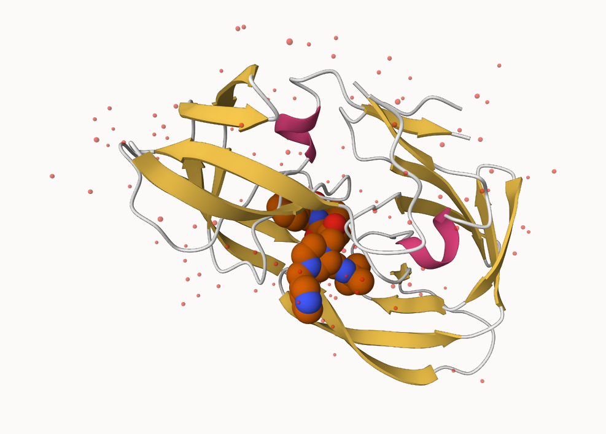

# Class 09: Structural Bioinformatics
Heidi Nam

## Introduction to the RCSB Protein Data Bank (PDB)

Downloading and reading the PDB file:

``` r
pdb <- read.csv("Data Export Summary.csv", row.names=1)
```

**Q1:** What percentage of structures in the PDB are solved by X-Ray and
Electron Microscopy.

- using `gsub` to remove the commas + using `as.numeric` to change
  character into numbers

- using `sum` command to get the sum

``` r
pdb_Total <- sum(as.numeric(gsub(",","",pdb$Total)))
pdb_xray <- sum(as.numeric(gsub(",","",pdb$X.ray)))
pdb_em <- sum(as.numeric(gsub(",","",pdb$EM)))

(pdb_xray + pdb_em) / pdb_Total * 100
```

    [1] 92.99297

A: Around 93% of structures in the PDB are solved by X-ray and electron
microscopy.

**Q2:** What proportion of structures in the PDB are protein?

``` r
pdb_protein <- sum(as.numeric(gsub(",","",pdb[1:3,"Total"])))
pdb_protein / pdb_Total * 100
```

    [1] 97.82287

A: Around 97.8% of structures in the PDB are protein

**Q3:** Type HIV in the PDB website search box on the home page and
determine how many HIV-1 protease structures are in the current PDB?

A: 45,184 HIV-1 protease structures are in the current PDB. (It is
difficult to achieve the data!)

## Visualizing the HIV-1 Protease structure

Figure 1: Getting to know HIV-Pr



Figure 2: Delving Deeper - (D25) Asp 25 chains

.png)

**Q4**: Water molecules normally have 3 atoms. Why do we see just one
atom per water molecule in this structure?

- We only see oxygen as hydrogen is very small; they do not have the
  resolution of hydrogen to be visualized in this model.

**Q5**: There is a critical “conserved” water molecule in the binding
site. Can you identify this water molecule? What residue number does
this water molecule have.

- 

**Q6**: Generate and save a figure clearly showing the two distinct
chains of HIV-protease along with the ligand. You might also consider
showing the catalytic residues ASP 25 in each chain and the critical
water (we recommend *“Ball & Stick”* for these side-chains). Add this
figure to your Quarto document.


## Introduction to Bio3D in R

``` r
library(bio3d)
pdb <- read.pdb("1hsg")
```

      Note: Accessing on-line PDB file

``` r
pdb
```


     Call:  read.pdb(file = "1hsg")

       Total Models#: 1
         Total Atoms#: 1686,  XYZs#: 5058  Chains#: 2  (values: A B)

         Protein Atoms#: 1514  (residues/Calpha atoms#: 198)
         Nucleic acid Atoms#: 0  (residues/phosphate atoms#: 0)

         Non-protein/nucleic Atoms#: 172  (residues: 128)
         Non-protein/nucleic resid values: [ HOH (127), MK1 (1) ]

       Protein sequence:
          PQITLWQRPLVTIKIGGQLKEALLDTGADDTVLEEMSLPGRWKPKMIGGIGGFIKVRQYD
          QILIEICGHKAIGTVLVGPTPVNIIGRNLLTQIGCTLNFPQITLWQRPLVTIKIGGQLKE
          ALLDTGADDTVLEEMSLPGRWKPKMIGGIGGFIKVRQYDQILIEICGHKAIGTVLVGPTP
          VNIIGRNLLTQIGCTLNF

    + attr: atom, xyz, seqres, helix, sheet,
            calpha, remark, call

- **Q7:** How many amino acid residues are there in this pdb object?

There are 198 amino acid residues.

- **Q8:** Name one of the two non-protein residues?

Water (HOH)

- **Q9:** How many protein chains are in this structure?

There are 2 chains in this structure.

Understanding attributes:

``` r
attributes(pdb)
```

    $names
    [1] "atom"   "xyz"    "seqres" "helix"  "sheet"  "calpha" "remark" "call"  

    $class
    [1] "pdb" "sse"

``` r
head(pdb$atom)
```

      type eleno elety  alt resid chain resno insert      x      y     z o     b
    1 ATOM     1     N <NA>   PRO     A     1   <NA> 29.361 39.686 5.862 1 38.10
    2 ATOM     2    CA <NA>   PRO     A     1   <NA> 30.307 38.663 5.319 1 40.62
    3 ATOM     3     C <NA>   PRO     A     1   <NA> 29.760 38.071 4.022 1 42.64
    4 ATOM     4     O <NA>   PRO     A     1   <NA> 28.600 38.302 3.676 1 43.40
    5 ATOM     5    CB <NA>   PRO     A     1   <NA> 30.508 37.541 6.342 1 37.87
    6 ATOM     6    CG <NA>   PRO     A     1   <NA> 29.296 37.591 7.162 1 38.40
      segid elesy charge
    1  <NA>     N   <NA>
    2  <NA>     C   <NA>
    3  <NA>     C   <NA>
    4  <NA>     O   <NA>
    5  <NA>     C   <NA>
    6  <NA>     C   <NA>

## Predicting functional motions of a single structure

Reading a different protein:

``` r
adk <- read.pdb("6s36")
```

      Note: Accessing on-line PDB file
       PDB has ALT records, taking A only, rm.alt=TRUE

Performing normal mode analysis and plotting:

``` r
m <- nma(adk)
```

     Building Hessian...        Done in 0.08 seconds.
     Diagonalizing Hessian...   Done in 0.54 seconds.

``` r
plot(m)
```


Creating movie trajectory:

``` r
mktrj(m, file="adk_m7.pdb")
```

## Comparative structure analysis of Adenylate Kinase

Installing packages needed:

``` r
#install.packages("bio3d")
#install.packages("devtools")
#install.packages("BiocManager")
#BiocManager::install("msa")
#devtools::install_bitbucket("Grantlab/bio3d-view")
```

**Q10.** Which of the packages above is found only on BioConductor and
not CRAN?

- msa

**Q11.** Which of the above packages is not found on BioConductor or
CRAN?:

- view

**Q12.** True or False? Functions from the devtools package can be used
to install packages from GitHub and BitBucket?

- True

### Search and retrieve ADK structures

``` r
library(bio3d)
aa <- get.seq("1ake_A")
```

    Warning in get.seq("1ake_A"): Removing existing file: seqs.fasta

    Fetching... Please wait. Done.

``` r
aa
```

                 1        .         .         .         .         .         60 
    pdb|1AKE|A   MRIILLGAPGAGKGTQAQFIMEKYGIPQISTGDMLRAAVKSGSELGKQAKDIMDAGKLVT
                 1        .         .         .         .         .         60 

                61        .         .         .         .         .         120 
    pdb|1AKE|A   DELVIALVKERIAQEDCRNGFLLDGFPRTIPQADAMKEAGINVDYVLEFDVPDELIVDRI
                61        .         .         .         .         .         120 

               121        .         .         .         .         .         180 
    pdb|1AKE|A   VGRRVHAPSGRVYHVKFNPPKVEGKDDVTGEELTTRKDDQEETVRKRLVEYHQMTAPLIG
               121        .         .         .         .         .         180 

               181        .         .         .   214 
    pdb|1AKE|A   YYSKEAEAGNTKYAKVDGTKPVAEVRADLEKILG
               181        .         .         .   214 

    Call:
      read.fasta(file = outfile)

    Class:
      fasta

    Alignment dimensions:
      1 sequence rows; 214 position columns (214 non-gap, 0 gap) 

    + attr: id, ali, call

**Q13.** How many amino acids are in this sequence, i.e. how long is
this sequence?

- it is 214 amino acids long.

### BLAST searching

``` r
# BLAST search
b <- blast.pdb(aa)
```

     Searching ... please wait (updates every 5 seconds) RID = 6FS4H09A013 
     .
     Reporting 83 hits

``` r
# Plot a summary of search results
hits <- plot(b)
```

      * Possible cutoff values:    197 11 
                Yielding Nhits:    17 83 

      * Chosen cutoff value of:    197 
                Yielding Nhits:    17 


``` r
# Download releated PDB files
files <- get.pdb(hits$pdb.id, path="pdbs", split=TRUE, gzip=TRUE)
```

    Warning in get.pdb(hits$pdb.id, path = "pdbs", split = TRUE, gzip = TRUE):
    pdbs/1AKE.pdb exists. Skipping download

    Warning in get.pdb(hits$pdb.id, path = "pdbs", split = TRUE, gzip = TRUE):
    pdbs/4X8M.pdb exists. Skipping download

    Warning in get.pdb(hits$pdb.id, path = "pdbs", split = TRUE, gzip = TRUE):
    pdbs/6S36.pdb exists. Skipping download

    Warning in get.pdb(hits$pdb.id, path = "pdbs", split = TRUE, gzip = TRUE):
    pdbs/6RZE.pdb exists. Skipping download

    Warning in get.pdb(hits$pdb.id, path = "pdbs", split = TRUE, gzip = TRUE):
    pdbs/4X8H.pdb exists. Skipping download

    Warning in get.pdb(hits$pdb.id, path = "pdbs", split = TRUE, gzip = TRUE):
    pdbs/3HPR.pdb exists. Skipping download

    Warning in get.pdb(hits$pdb.id, path = "pdbs", split = TRUE, gzip = TRUE):
    pdbs/1E4V.pdb exists. Skipping download

    Warning in get.pdb(hits$pdb.id, path = "pdbs", split = TRUE, gzip = TRUE):
    pdbs/5EJE.pdb exists. Skipping download

    Warning in get.pdb(hits$pdb.id, path = "pdbs", split = TRUE, gzip = TRUE):
    pdbs/1E4Y.pdb exists. Skipping download

    Warning in get.pdb(hits$pdb.id, path = "pdbs", split = TRUE, gzip = TRUE):
    pdbs/3X2S.pdb exists. Skipping download

    Warning in get.pdb(hits$pdb.id, path = "pdbs", split = TRUE, gzip = TRUE):
    pdbs/6HAP.pdb exists. Skipping download

    Warning in get.pdb(hits$pdb.id, path = "pdbs", split = TRUE, gzip = TRUE):
    pdbs/6HAM.pdb exists. Skipping download

    Warning in get.pdb(hits$pdb.id, path = "pdbs", split = TRUE, gzip = TRUE):
    pdbs/4K46.pdb exists. Skipping download

    Warning in get.pdb(hits$pdb.id, path = "pdbs", split = TRUE, gzip = TRUE):
    pdbs/4NP6.pdb exists. Skipping download

    Warning in get.pdb(hits$pdb.id, path = "pdbs", split = TRUE, gzip = TRUE):
    pdbs/3GMT.pdb exists. Skipping download

    Warning in get.pdb(hits$pdb.id, path = "pdbs", split = TRUE, gzip = TRUE):
    pdbs/4PZL.pdb exists. Skipping download


      |                                                                            
      |                                                                      |   0%
      |                                                                            
      |====                                                                  |   6%
      |                                                                            
      |========                                                              |  12%
      |                                                                            
      |============                                                          |  18%
      |                                                                            
      |================                                                      |  24%
      |                                                                            
      |=====================                                                 |  29%
      |                                                                            
      |=========================                                             |  35%
      |                                                                            
      |=============================                                         |  41%
      |                                                                            
      |=================================                                     |  47%
      |                                                                            
      |=====================================                                 |  53%
      |                                                                            
      |=========================================                             |  59%
      |                                                                            
      |=============================================                         |  65%
      |                                                                            
      |=================================================                     |  71%
      |                                                                            
      |======================================================                |  76%
      |                                                                            
      |==========================================================            |  82%
      |                                                                            
      |==============================================================        |  88%
      |                                                                            
      |==================================================================    |  94%
      |                                                                            
      |======================================================================| 100%

``` r
# Align releated PDBs
pdbs <- pdbaln(files, fit = TRUE, exefile="msa")
```

    Reading PDB files:
    pdbs/split_chain/1AKE_A.pdb
    pdbs/split_chain/8BQF_A.pdb
    pdbs/split_chain/4X8M_A.pdb
    pdbs/split_chain/6S36_A.pdb
    pdbs/split_chain/6RZE_A.pdb
    pdbs/split_chain/4X8H_A.pdb
    pdbs/split_chain/3HPR_A.pdb
    pdbs/split_chain/1E4V_A.pdb
    pdbs/split_chain/5EJE_A.pdb
    pdbs/split_chain/1E4Y_A.pdb
    pdbs/split_chain/3X2S_A.pdb
    pdbs/split_chain/6HAP_A.pdb
    pdbs/split_chain/6HAM_A.pdb
    pdbs/split_chain/4K46_A.pdb
    pdbs/split_chain/4NP6_A.pdb
    pdbs/split_chain/3GMT_A.pdb
    pdbs/split_chain/4PZL_A.pdb
       PDB has ALT records, taking A only, rm.alt=TRUE
    .   PDB has ALT records, taking A only, rm.alt=TRUE
    ..   PDB has ALT records, taking A only, rm.alt=TRUE
    .   PDB has ALT records, taking A only, rm.alt=TRUE
    ..   PDB has ALT records, taking A only, rm.alt=TRUE
    ..   PDB has ALT records, taking A only, rm.alt=TRUE
    ....   PDB has ALT records, taking A only, rm.alt=TRUE
    .   PDB has ALT records, taking A only, rm.alt=TRUE
    ....

    Extracting sequences

    pdb/seq: 1   name: pdbs/split_chain/1AKE_A.pdb 
       PDB has ALT records, taking A only, rm.alt=TRUE
    pdb/seq: 2   name: pdbs/split_chain/8BQF_A.pdb 
       PDB has ALT records, taking A only, rm.alt=TRUE
    pdb/seq: 3   name: pdbs/split_chain/4X8M_A.pdb 
    pdb/seq: 4   name: pdbs/split_chain/6S36_A.pdb 
       PDB has ALT records, taking A only, rm.alt=TRUE
    pdb/seq: 5   name: pdbs/split_chain/6RZE_A.pdb 
       PDB has ALT records, taking A only, rm.alt=TRUE
    pdb/seq: 6   name: pdbs/split_chain/4X8H_A.pdb 
    pdb/seq: 7   name: pdbs/split_chain/3HPR_A.pdb 
       PDB has ALT records, taking A only, rm.alt=TRUE
    pdb/seq: 8   name: pdbs/split_chain/1E4V_A.pdb 
    pdb/seq: 9   name: pdbs/split_chain/5EJE_A.pdb 
       PDB has ALT records, taking A only, rm.alt=TRUE
    pdb/seq: 10   name: pdbs/split_chain/1E4Y_A.pdb 
    pdb/seq: 11   name: pdbs/split_chain/3X2S_A.pdb 
    pdb/seq: 12   name: pdbs/split_chain/6HAP_A.pdb 
    pdb/seq: 13   name: pdbs/split_chain/6HAM_A.pdb 
       PDB has ALT records, taking A only, rm.alt=TRUE
    pdb/seq: 14   name: pdbs/split_chain/4K46_A.pdb 
       PDB has ALT records, taking A only, rm.alt=TRUE
    pdb/seq: 15   name: pdbs/split_chain/4NP6_A.pdb 
    pdb/seq: 16   name: pdbs/split_chain/3GMT_A.pdb 
    pdb/seq: 17   name: pdbs/split_chain/4PZL_A.pdb 

``` r
# Vector containing PDB codes for figure axis
ids <- basename.pdb(pdbs$id)

# Draw schematic alignment
plot(pdbs, labels=ids)
```


### Annotating collected PDB structures:

``` r
anno <- pdb.annotate(ids)
unique(anno$source)
```

    [1] "Escherichia coli"                                
    [2] "Escherichia coli K-12"                           
    [3] "Escherichia coli O139:H28 str. E24377A"          
    [4] "Escherichia coli str. K-12 substr. MDS42"        
    [5] "Photobacterium profundum"                        
    [6] "Vibrio cholerae O1 biovar El Tor str. N16961"    
    [7] "Burkholderia pseudomallei 1710b"                 
    [8] "Francisella tularensis subsp. tularensis SCHU S4"

### Principal component analysis

``` r
# Perform PCA
pc.xray <- pca(pdbs)
plot(pc.xray)
```


Using function `rmsd()`, which uses clustering analysis based on
pairwise standard deviation:

``` r
# Calculate RMSD
rd <- rmsd(pdbs)
```

    Warning in rmsd(pdbs): No indices provided, using the 199 non NA positions

``` r
# Structure-based clustering
hc.rd <- hclust(dist(rd))
grps.rd <- cutree(hc.rd, k=3)

plot(pc.xray, 1:2, col="grey50", bg=grps.rd, pch=21, cex=1)
```


