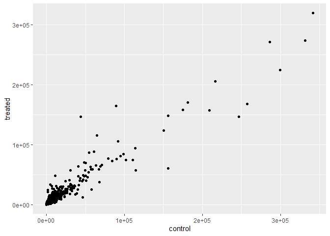
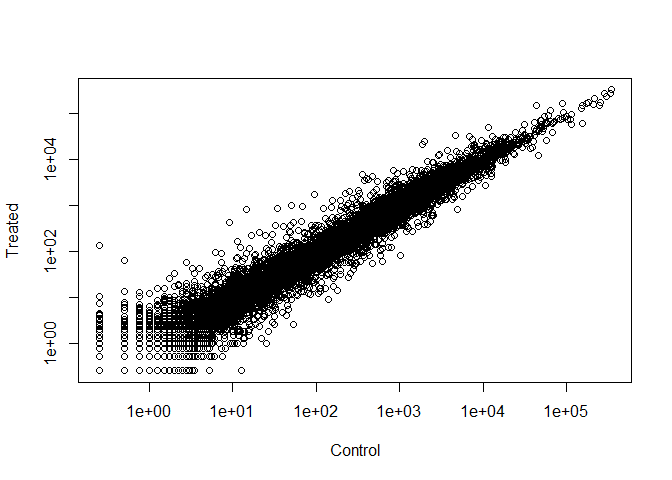

# Class 12: Transcriptomics and the analysis of RNA-Seq data
Heidi Nam

## Bioconductor and DESeq2 setup

code used to set up packages needed for this lab:

``` r
# install.packages("BiocManager")
# BiocManager::install()
# BiocManager::install("DESeq2")
```

## Import `countData` and `colData`

importing data used for this lab:

``` r
counts <- read.csv("airway_scaledcounts.csv", row.names=1)
metadata <-  read.csv("airway_metadata.csv")
control_cell_lines <- table(metadata$dex)['control']
```

Q1 answer: There are 38694 genes in the dataset.

Q2 answer: We have 4 ‘control’ cell lines in this dataset.

## Toy differential gene expression

let’s look at differential gene expression analysis:

``` r
control <- metadata[metadata[,"dex"]=="control",]
control.counts <- counts[ ,control$id]
control.mean <- rowSums( control.counts )/4 
head(control.mean)
```

    ENSG00000000003 ENSG00000000005 ENSG00000000419 ENSG00000000457 ENSG00000000460 
             900.75            0.00          520.50          339.75           97.25 
    ENSG00000000938 
               0.75 

**Q3.** How would you make the above code in either approach more
robust?

- when calculating the mean, instead of putting 4 (which shows the
  number of control lines) we could use `nrow(control)` which would make
  the `control.mean` a lot more robust.

- or, just using `rowMeans(control.counts)`

Q4: Follow the same procedure for the `treated` samples (i.e. calculate
the mean per gene across drug treated samples and assign to a labeled
vector called `treated.mean`)

``` r
treated <- metadata[metadata[,"dex"]=="treated",]
treated.counts <- counts[ ,treated$id]
treated.mean <- rowSums( treated.counts )/4 
head(treated.mean)
```

    ENSG00000000003 ENSG00000000005 ENSG00000000419 ENSG00000000457 ENSG00000000460 
             658.00            0.00          546.00          316.50           78.75 
    ENSG00000000938 
               0.00 

placing `meancount` data into a dataframe:

``` r
meancounts <- data.frame(control.mean, treated.mean)
```

**Q5 (a).** Create a scatter plot showing the mean of the treated
samples against the mean of the control samples.

``` r
plot(meancounts[,1],meancounts[,2], xlab="Control", ylab="Treated")
```


**Q5 (b).**You could also use the **ggplot2** package to make this
figure producing the plot below. What **geom\_?()** function would you
use for this plot?

- geom_point() would be used for this plot.

``` r
library(ggplot2)
ggplot(meancounts) + 
  aes(x=meancounts[,1],y=meancounts[,2]) + 
  labs(x = "control", y ="treated") +
  geom_point()
```



**Q6.** Try plotting both axes on a log scale. What is the argument to
**plot()** that allows you to do this?

- `log = "xy"`

``` r
plot(meancounts[,1], meancounts[,2], log="xy", xlab="Control", ylab="Treated")
```

    Warning in xy.coords(x, y, xlabel, ylabel, log): 15032 x values <= 0 omitted
    from logarithmic plot

    Warning in xy.coords(x, y, xlabel, ylabel, log): 15281 y values <= 0 omitted
    from logarithmic plot



looking at log2 of the fold change between and treated and control:

``` r
meancounts$log2fc <- log2(meancounts[,"treated.mean"]/meancounts[,"control.mean"])
head(meancounts)
```

                    control.mean treated.mean      log2fc
    ENSG00000000003       900.75       658.00 -0.45303916
    ENSG00000000005         0.00         0.00         NaN
    ENSG00000000419       520.50       546.00  0.06900279
    ENSG00000000457       339.75       316.50 -0.10226805
    ENSG00000000460        97.25        78.75 -0.30441833
    ENSG00000000938         0.75         0.00        -Inf

filtering weird results by removing zero values:

``` r
zero.vals <- which(meancounts[,1:2]==0, arr.ind=TRUE)
to.rm <- unique(zero.vals[,1])
mycounts <- meancounts[-to.rm,]
head(mycounts)
```

                    control.mean treated.mean      log2fc
    ENSG00000000003       900.75       658.00 -0.45303916
    ENSG00000000419       520.50       546.00  0.06900279
    ENSG00000000457       339.75       316.50 -0.10226805
    ENSG00000000460        97.25        78.75 -0.30441833
    ENSG00000000971      5219.00      6687.50  0.35769358
    ENSG00000001036      2327.00      1785.75 -0.38194109

**Q7.** What is the purpose of the `arr.ind` argument in the **which()**
function call above? Why would we then take the first column of the
output and need to call the **unique()** function?

- The `arr.ind` calls anything that shows anything where they have zero
  counts for both control mean and treated mean; the first column was
  taken in order to ignore genes that have zero counts in any sample;
  the `unique()` function ensured we don’t count genes twice if both of
  their entries are zero.

filtering for over and under-expressed genes:

``` r
up.ind <- mycounts$log2fc > 2
down.ind <- mycounts$log2fc < (-2)
table(up.ind)
```

    up.ind
    FALSE  TRUE 
    21567   250 

``` r
table(down.ind)
```

    down.ind
    FALSE  TRUE 
    21450   367 

**Q8.** Using the `up.ind` vector above can you determine how many up
regulated genes we have at the greater than 2 fc level?

- there are 250 genes that are up regulated.

Q**9.** Using the `down.ind` vector above can you determine how many
down regulated genes we have at the greater than 2 fc level?

- there are 367 genes that are down regulated.

**Q10.** Do you trust these results? Why or why not?

- These results are not reliable as we have not brought in statistical
  analysis to it; we do not know if the results are statistically
  significant in order to trust these results.

## DESeq2 Analysis

Loading the library:

``` r
library(DESeq2)
```

    Loading required package: S4Vectors

    Loading required package: stats4

    Loading required package: BiocGenerics


    Attaching package: 'BiocGenerics'

    The following objects are masked from 'package:stats':

        IQR, mad, sd, var, xtabs

    The following objects are masked from 'package:base':

        anyDuplicated, aperm, append, as.data.frame, basename, cbind,
        colnames, dirname, do.call, duplicated, eval, evalq, Filter, Find,
        get, grep, grepl, intersect, is.unsorted, lapply, Map, mapply,
        match, mget, order, paste, pmax, pmax.int, pmin, pmin.int,
        Position, rank, rbind, Reduce, rownames, sapply, setdiff, sort,
        table, tapply, union, unique, unsplit, which.max, which.min


    Attaching package: 'S4Vectors'

    The following objects are masked from 'package:base':

        expand.grid, I, unname

    Loading required package: IRanges


    Attaching package: 'IRanges'

    The following object is masked from 'package:grDevices':

        windows

    Loading required package: GenomicRanges

    Loading required package: GenomeInfoDb

    Loading required package: SummarizedExperiment

    Loading required package: MatrixGenerics

    Loading required package: matrixStats


    Attaching package: 'MatrixGenerics'

    The following objects are masked from 'package:matrixStats':

        colAlls, colAnyNAs, colAnys, colAvgsPerRowSet, colCollapse,
        colCounts, colCummaxs, colCummins, colCumprods, colCumsums,
        colDiffs, colIQRDiffs, colIQRs, colLogSumExps, colMadDiffs,
        colMads, colMaxs, colMeans2, colMedians, colMins, colOrderStats,
        colProds, colQuantiles, colRanges, colRanks, colSdDiffs, colSds,
        colSums2, colTabulates, colVarDiffs, colVars, colWeightedMads,
        colWeightedMeans, colWeightedMedians, colWeightedSds,
        colWeightedVars, rowAlls, rowAnyNAs, rowAnys, rowAvgsPerColSet,
        rowCollapse, rowCounts, rowCummaxs, rowCummins, rowCumprods,
        rowCumsums, rowDiffs, rowIQRDiffs, rowIQRs, rowLogSumExps,
        rowMadDiffs, rowMads, rowMaxs, rowMeans2, rowMedians, rowMins,
        rowOrderStats, rowProds, rowQuantiles, rowRanges, rowRanks,
        rowSdDiffs, rowSds, rowSums2, rowTabulates, rowVarDiffs, rowVars,
        rowWeightedMads, rowWeightedMeans, rowWeightedMedians,
        rowWeightedSds, rowWeightedVars

    Loading required package: Biobase

    Welcome to Bioconductor

        Vignettes contain introductory material; view with
        'browseVignettes()'. To cite Bioconductor, see
        'citation("Biobase")', and for packages 'citation("pkgname")'.


    Attaching package: 'Biobase'

    The following object is masked from 'package:MatrixGenerics':

        rowMedians

    The following objects are masked from 'package:matrixStats':

        anyMissing, rowMedians

``` r
# citation("DESeq2")
```

Let’s generate the specific object that `DESeq2` needs:

``` r
dds <- DESeqDataSetFromMatrix(countData=counts, 
                              colData=metadata, 
                              design=~dex)
```

    converting counts to integer mode

    Warning in DESeqDataSet(se, design = design, ignoreRank): some variables in
    design formula are characters, converting to factors

``` r
dds
```

    class: DESeqDataSet 
    dim: 38694 8 
    metadata(1): version
    assays(1): counts
    rownames(38694): ENSG00000000003 ENSG00000000005 ... ENSG00000283120
      ENSG00000283123
    rowData names(0):
    colnames(8): SRR1039508 SRR1039509 ... SRR1039520 SRR1039521
    colData names(4): id dex celltype geo_id

``` r
dds <- DESeq(dds)
```

    estimating size factors

    estimating dispersions

    gene-wise dispersion estimates

    mean-dispersion relationship

    final dispersion estimates

    fitting model and testing

``` r
res <- results(dds)
```

``` r
summary(res)
```


    out of 25258 with nonzero total read count
    adjusted p-value < 0.1
    LFC > 0 (up)       : 1563, 6.2%
    LFC < 0 (down)     : 1188, 4.7%
    outliers [1]       : 142, 0.56%
    low counts [2]     : 9971, 39%
    (mean count < 10)
    [1] see 'cooksCutoff' argument of ?results
    [2] see 'independentFiltering' argument of ?results

Changing p-value to 0.05:

``` r
res05 <- results(dds, alpha=0.05)
summary(res05)
```


    out of 25258 with nonzero total read count
    adjusted p-value < 0.05
    LFC > 0 (up)       : 1236, 4.9%
    LFC < 0 (down)     : 933, 3.7%
    outliers [1]       : 142, 0.56%
    low counts [2]     : 9033, 36%
    (mean count < 6)
    [1] see 'cooksCutoff' argument of ?results
    [2] see 'independentFiltering' argument of ?results

## Data visualization

Volcano plots:

``` r
plot( res$log2FoldChange,  -log(res$padj), 
      xlab="Log2(FoldChange)",
      ylab="-Log(P-value)")
```


