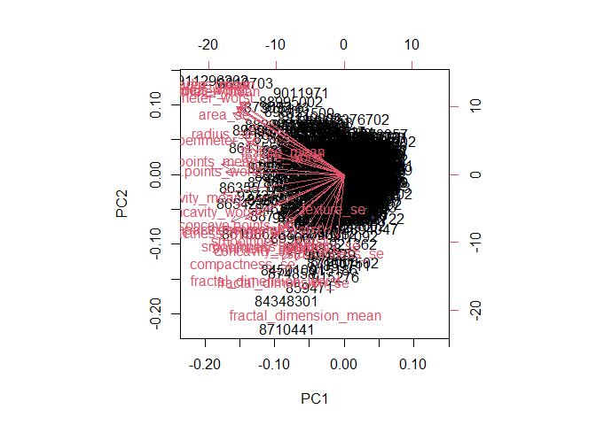
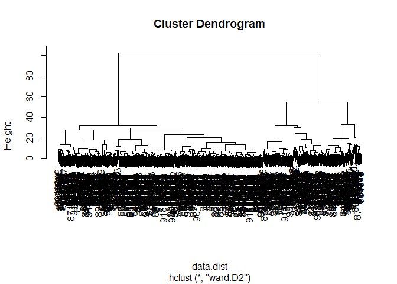

# Class 08: Unsupervised Learning Mini-project
Heidi Nam

## Exploratory Data Analysis

We are using the excel file `"WisconsinCancer.csv"` as our data. We will
download and read the csv file:

``` r
fna.data <- "WisconsinCancer.csv"
wisc.df <- read.csv(fna.data, row.names=1)
```

As we don’t need the diagnosis table within our data frame `wisc.df`, we
will record it separately into a `diagnosis` vector.

``` r
wisc.data <- wisc.df[,-1]
diagnosis <- factor(wisc.df[,1])
```

Answering questions 1~3:

Q1: How many observations are in this dataset?

``` r
nrow(wisc.df)
```

    [1] 569

There are 569 observations in this dataset.

Q**2**. How many of the observations have a malignant diagnosis?

``` r
sum(diagnosis == "M")
```

    [1] 212

There are 212 observations with a malignant diagnosis.

**Q3**. How many variables/features in the data are suffixed with
`_mean`?

``` r
length(grep("_mean",colnames(wisc.data)))
```

    [1] 10

There are 10 variables that are suffixed with `"_mean"`.

## Principal Component Analysis (PCA)

Checking if the data needs to be scaled before performing PCA:

``` r
# Check column means and standard deviations
colMeans(wisc.data)
```

                radius_mean            texture_mean          perimeter_mean 
               1.412729e+01            1.928965e+01            9.196903e+01 
                  area_mean         smoothness_mean        compactness_mean 
               6.548891e+02            9.636028e-02            1.043410e-01 
             concavity_mean     concave.points_mean           symmetry_mean 
               8.879932e-02            4.891915e-02            1.811619e-01 
     fractal_dimension_mean               radius_se              texture_se 
               6.279761e-02            4.051721e-01            1.216853e+00 
               perimeter_se                 area_se           smoothness_se 
               2.866059e+00            4.033708e+01            7.040979e-03 
             compactness_se            concavity_se       concave.points_se 
               2.547814e-02            3.189372e-02            1.179614e-02 
                symmetry_se    fractal_dimension_se            radius_worst 
               2.054230e-02            3.794904e-03            1.626919e+01 
              texture_worst         perimeter_worst              area_worst 
               2.567722e+01            1.072612e+02            8.805831e+02 
           smoothness_worst       compactness_worst         concavity_worst 
               1.323686e-01            2.542650e-01            2.721885e-01 
       concave.points_worst          symmetry_worst fractal_dimension_worst 
               1.146062e-01            2.900756e-01            8.394582e-02 

``` r
apply(wisc.data,2,sd)
```

                radius_mean            texture_mean          perimeter_mean 
               3.524049e+00            4.301036e+00            2.429898e+01 
                  area_mean         smoothness_mean        compactness_mean 
               3.519141e+02            1.406413e-02            5.281276e-02 
             concavity_mean     concave.points_mean           symmetry_mean 
               7.971981e-02            3.880284e-02            2.741428e-02 
     fractal_dimension_mean               radius_se              texture_se 
               7.060363e-03            2.773127e-01            5.516484e-01 
               perimeter_se                 area_se           smoothness_se 
               2.021855e+00            4.549101e+01            3.002518e-03 
             compactness_se            concavity_se       concave.points_se 
               1.790818e-02            3.018606e-02            6.170285e-03 
                symmetry_se    fractal_dimension_se            radius_worst 
               8.266372e-03            2.646071e-03            4.833242e+00 
              texture_worst         perimeter_worst              area_worst 
               6.146258e+00            3.360254e+01            5.693570e+02 
           smoothness_worst       compactness_worst         concavity_worst 
               2.283243e-02            1.573365e-01            2.086243e-01 
       concave.points_worst          symmetry_worst fractal_dimension_worst 
               6.573234e-02            6.186747e-02            1.806127e-02 

Performing PCA with scaling:

``` r
wisc.pr <- prcomp(wisc.data,scale. = TRUE)
summary(wisc.pr)
```

    Importance of components:
                              PC1    PC2     PC3     PC4     PC5     PC6     PC7
    Standard deviation     3.6444 2.3857 1.67867 1.40735 1.28403 1.09880 0.82172
    Proportion of Variance 0.4427 0.1897 0.09393 0.06602 0.05496 0.04025 0.02251
    Cumulative Proportion  0.4427 0.6324 0.72636 0.79239 0.84734 0.88759 0.91010
                               PC8    PC9    PC10   PC11    PC12    PC13    PC14
    Standard deviation     0.69037 0.6457 0.59219 0.5421 0.51104 0.49128 0.39624
    Proportion of Variance 0.01589 0.0139 0.01169 0.0098 0.00871 0.00805 0.00523
    Cumulative Proportion  0.92598 0.9399 0.95157 0.9614 0.97007 0.97812 0.98335
                              PC15    PC16    PC17    PC18    PC19    PC20   PC21
    Standard deviation     0.30681 0.28260 0.24372 0.22939 0.22244 0.17652 0.1731
    Proportion of Variance 0.00314 0.00266 0.00198 0.00175 0.00165 0.00104 0.0010
    Cumulative Proportion  0.98649 0.98915 0.99113 0.99288 0.99453 0.99557 0.9966
                              PC22    PC23   PC24    PC25    PC26    PC27    PC28
    Standard deviation     0.16565 0.15602 0.1344 0.12442 0.09043 0.08307 0.03987
    Proportion of Variance 0.00091 0.00081 0.0006 0.00052 0.00027 0.00023 0.00005
    Cumulative Proportion  0.99749 0.99830 0.9989 0.99942 0.99969 0.99992 0.99997
                              PC29    PC30
    Standard deviation     0.02736 0.01153
    Proportion of Variance 0.00002 0.00000
    Cumulative Proportion  1.00000 1.00000

Answering questions 4-6:

**Q4**. From your results, what proportion of the original variance is
captured by the first principal components (PC1)?

A: 0.4427 (44.27%) of the original variance is captured by the first
principal component PC1.

**Q5**. How many principal components (PCs) are required to describe at
least 70% of the original variance in the data?

A: The first three principal components describe at least 70% of the
original variance in the data.

**Q6**. How many principal components (PCs) are required to describe at
least 90% of the original variance in the data?

A: The first seven principal components describe at least 90% of the
original variance.

### Interpreting PCA results

Plotting the PCA results into a biplot:

``` r
biplot(wisc.pr)
```



Q7: What stands out to you about this plot? Is it easy or difficult to
understand? Why?

A: This plot is able to plot both the diagnosis number and the different
variables and how they can be expressed on the plot with the first and
second principal components. However, This is very difficult to
understand as we don’t understand why the plot originates from one
center origin (and what it signifies) as well as have a lot of overlap
of text and lines that makes the plot difficult to read.

Instead, plotting a scatter plot to observe the relation of the two
principal components that are categorized by their diagnosis (malignant
or benign).

``` r
plot( wisc.pr$x[,1:2], col=diagnosis,
     xlab = "PC1", ylab = "PC2")
```


**Q8.** Generate a similar plot for principal components 1 and 3. What
do you notice about these plots?

``` r
plot( wisc.pr$x[,c(1,3)], col=diagnosis,
     xlab = "PC1", ylab = "PC3")
```


The plot feels a lot more cluttered and its outliers feel a lot more
variant as it has a higher range of PC3; thus, it feels like it doesn’t
optimally capture the data well.

Using ggplot to understand the data in a more visually aesthetic
platform:

``` r
df <- as.data.frame(wisc.pr$x)
df$diagnosis <- diagnosis

library(ggplot2)

ggplot(df) + 
  aes(PC1, PC2, col=diagnosis) + 
  geom_point()
```


### Variance explained

Understanding the proportion of variance by calculating the variance of
each principal component by taking is standard deviation and squaring
it:

``` r
# Calculate variance of each component
pr.var <- wisc.pr$sdev^2
head(pr.var)
```

    [1] 13.281608  5.691355  2.817949  1.980640  1.648731  1.207357

Calculating proportion of variance by dividing the variance by total
variance of principal components:

``` r
pve <- pr.var / sum(pr.var)
```

Plotting this into a scree plot:

``` r
plot(pve, xlab = "Principal Component", 
     ylab = "Proportion of Variance Explained", 
     ylim = c(0, 1), type = "o")
```


Presenting the same data in a bar plot:

``` r
barplot(pve, ylab = "Precent of Variance Explained",
     names.arg=paste0("PC",1:length(pve)), las=2, axes = FALSE)
axis(2, at=pve, labels=round(pve,2)*100 )
```


Plotting using a ggplot based graph:

``` r
# install.packages("factoextra")
library(factoextra)
```

    Welcome! Want to learn more? See two factoextra-related books at https://goo.gl/ve3WBa

``` r
fviz_eig(wisc.pr, addlabels = TRUE)
```


**Q9.** For the first principal component, what is the component of the
loading vector (i.e. `wisc.pr$rotation[,1]`) for the feature
`concave.points_mean`? This tells us how much this original feature
contributes to the first PC.

``` r
loading_vector <- wisc.pr$rotation[,1]
loading_vector["concave.points_mean"]
```

    concave.points_mean 
             -0.2608538 

The component of the loading vector is -0.2608538.

## Hierarchical Clustering

Scaling `wisc.data` by using the `scale()` function:

``` r
data.scaled <- scale(wisc.data)
```

Calculating distances between all pairs of observations:

``` r
data.dist <- dist(data.scaled)
```

Creating hierarchical clustering model using complete linkage:

``` r
wisc.hclust <- hclust(data.dist, "complete")
```

Q10: Using the `plot()` and `abline()` functions, what is the height at
which the clustering model has 4 clusters?

``` r
plot(wisc.hclust)
abline(h=19, col="red", lty=2)
```


A: The height is 19 in where the clustering model has 4 clusters.

### Selecting number of clusters

Cutting the cluster tree to have 4 clusters:

``` r
wisc.hclust.clusters <- cutree(wisc.hclust,4)
```

Comparing cluster membership to the diagnoses:

``` r
table(wisc.hclust.clusters, diagnosis)
```

                        diagnosis
    wisc.hclust.clusters   B   M
                       1  12 165
                       2   2   5
                       3 343  40
                       4   0   2

### Using different methods

**Q12.** Which method gives your favorite results for the same
`data.dist` dataset? Explain your reasoning.

A: I prefer the complete method when trying hierarchical clustering as
it compares the max values of each “cluster” in order to judge
similarity, and I believe that’s a good way of comparison as it makes
sure to contain all the data points into consideration.

## Combining methods

Creating hierarchical clustering model using method=“ward.D2”.

``` r
wisc.pr.hclust <- hclust(data.dist, "ward.D2")
plot(wisc.pr.hclust)
```



Checking the clustering:

``` r
grps <- cutree(wisc.pr.hclust, k=2)
table(grps)
```

    grps
      1   2 
    184 385 

Checking the two cluster groups in terms of diagnosis:

``` r
table(grps, diagnosis)
```

        diagnosis
    grps   B   M
       1  20 164
       2 337  48

Plotting the principal components again categorized by the groups:

``` r
plot(wisc.pr$x[,1:2], col=grps)
```


Comparing it to the graph where it is categorized by diagnosis:

``` r
plot(wisc.pr$x[,1:2], col=diagnosis)
```


Changing the graph that was categorized by the groups to follow the same
color scheme as the PCA diagnosis graph by changing order of 1 and 2 in
grps:

``` r
g <- as.factor(grps)
g <- relevel(g,2)
plot(wisc.pr$x[,1:2], col=g)
```


Using the distance along the first seven principal components for
clustering so that we could compare:

``` r
wisc.pr.hclust <- hclust(dist(wisc.pr$x[,1:7]), method="ward.D2")
```

cutting this hierarchical cluster into 2 clusters:

``` r
wisc.pr.hclust.clusters <- cutree(wisc.pr.hclust, k=2)
```

**Q13**. How well does the newly created model with four clusters
separate out the two diagnoses?

``` r
table(wisc.pr.hclust.clusters,diagnosis)
```

                           diagnosis
    wisc.pr.hclust.clusters   B   M
                          1  28 188
                          2 329  24

The newly created model helps separate the two diagnosis almost as well
as the Euclidean distances taken from the data that was plotted with
hierarchical clustering with the method = “ward.D2”.

**Q14**. How well do the hierarchical clustering models you created in
previous sections (i.e. before PCA) do in terms of separating the
diagnoses? Again, use the `table()` function to compare the output of
each model (`wisc.km$cluster` and `wisc.hclust.clusters`) with the
vector containing the actual diagnoses.

``` r
table(wisc.hclust.clusters,diagnosis)
```

                        diagnosis
    wisc.hclust.clusters   B   M
                       1  12 165
                       2   2   5
                       3 343  40
                       4   0   2

The hierarchical clustering models created in previous sections are not
as effective as it causes clusters 2 and 4 to not contain enough data to
consider the clusters to be significant.

## Prediction

Predicting the diagnosis using the `predict()` function; new cancer data
from two patients are downloaded and plotted against the PCA graph:

``` r
#downloading data
url <- "https://tinyurl.com/new-samples-CSV"
new <- read.csv(url)
npc <- predict(wisc.pr, newdata=new)
```

``` r
#plotting with the PCA graph
plot(wisc.pr$x[,1:2], col=g)
points(npc[,1], npc[,2], col="blue", pch=16, cex=3)
text(npc[,1], npc[,2], c(1,2), col="white")
```


Q16: Which of these new patients should we prioritize for follow up
based on your results?

A: We should prioritize patient 2 as it resides within the collection of
data that were diagnosed as malicious.
